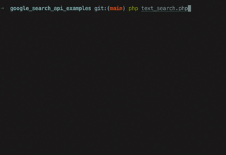

# Google Custom Search API Examples in PHP

This repository contains examples demonstrating how to use the Google Custom Search API in PHP, leveraging the `google/apiclient` Composer package. The examples showcase different capabilities of the Custom Search API, including performing a standard search and finding similar images.



## Installation

### Prerequisites

- PHP environment
- Composer for managing PHP dependencies

### Steps

1. **Clone the Repository**: Start by cloning this repository to your local machine.

   ```
   git clone https://github.com/beaubus/google-search-api-examples.git
   ```

2. **Install Dependencies**: Navigate to the cloned directory and install the required Composer dependencies.

   ```
   composer require symfony/dotenv google/apiclient
   ```

3. **Configuration**:

    - Create a `.env` file in the root directory of the project.
    - Add the following environment variables to the `.env` file:
      ```
      APP_NAME=[Your Google App Name]
      API_KEY=[Your Google API Key]
      CSE_ID=[Your Google Custom Search Engine ID]
      ```
    - Obtain your API Key at https://developers.google.com/custom-search/v1/introduction
    - Set up your Custom Search Engine at https://programmablesearchengine.google.com/controlpanel/create
    - Manage keys at https://console.cloud.google.com/apis/credentials

4. **Usage**: The repository contains PHP scripts that can be executed from the command line or integrated into a PHP web application.

## Scripts

- `search_example.php`: Demonstrates a standard Google Custom Search.
- `image_search_example.php`: Illustrates finding similar images using the Google Custom Search API.


## License

This project is licensed under the [MIT License](LICENSE).